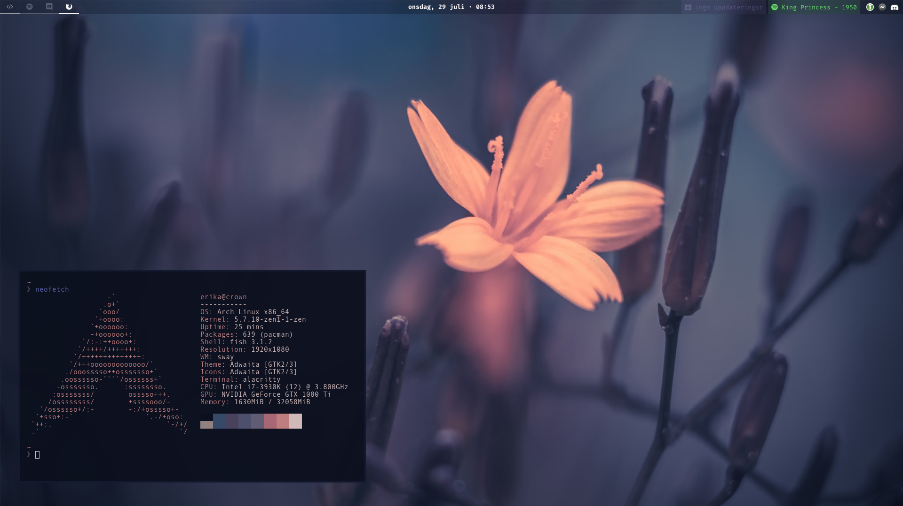

# Dotfiles

## Configuration:

- Distribution: [Arch Linux](https://www.archlinux.org/)
- WM: [Sway](https://github.com/swaywm/sway)
- Bar: [Waybar](https://github.com/Alexays/Waybar/)
- Terminal: [Alacritty](https://github.com/alacritty/alacritty)
- Shell: [Fish](https://fishshell.com/)
- Launcher: [Rofi](https://github.com/davatorium/rofi/)

*Notes*: This is a [Wayland](https://gitlab.freedesktop.org/wayland) setup. Configs I used before switching to Wayland can be found in the [_old folder](./_old)

## Installing

A relatively bare-bone script to automatically install the dotfiles (install packages and do symlinks) exist ([install.sh](./install.sh)) however, it makes the following assumptions:

- You're using Arch Linux (internally use pacman to install packages)
- You want to install all the files, you can't select specific features but you can choose not to do symlinks and do those manually
- Your dotfiles are located at `~/dotfiles` (only required for symlinking)

⚠️ **Important: When doing symlinking, the script will FORCE DELETE  (`rm -f`) files before doing the links. This might result in data loss if you're not careful. Beware!**

### AUR

The install script doesn't install packages and dependencies only available in the AUR, you'll have to install those manually. An AUR helper will not be installed [(I recommend yay if one is needed)](https://github.com/Jguer/yay)

- [Autotiling](https://github.com/nwg-piotr/autotiling) switch the split orientation automatically based on current window dimensions (like bspwm and dwm).
    - [An alternative to this with better performance](https://github.com/chmln/i3-auto-layout) exists however, it [currently breaks tabbed and stacked layouts](https://github.com/chmln/i3-auto-layout/issues/2)
- [Git version of Grimshot](https://aur.archlinux.org/packages/grimshot-git/), for the window screenshot feature (super+shift+p). This won't be needed once the [grimshot package](https://aur.archlinux.org/packages/grimshot) is updated.
- [Iosevka](https://aur.archlinux.org/packages/ttf-iosevka) and [Iosevka Slab](https://aur.archlinux.org/packages/ttf-iosevka-slab), the normal version is used in our code editor whereas the slab version is used everywhere else (window titles, bar, terminal etc)

A [list](https://wiki.archlinux.org/index.php/Pacman/Tips_and_tricks#Install_packages_from_a_list) of the AUR packages required can be found in the [aur-packages](./aur-packages) file

## Autostart

Make sure to checkout the [autostart](./sway/autostart) file located in the [sway](./sway) folder and removing the entries you don't need.

Only the `wal` line is needed for the setup to work since this setup use [pywal](https://github.com/dylanaraps/pywal) to automatically generate a color scheme based on my wallpaper. All the config files are based on the color scheme generated so if you're using another wallpaper / no wallpaper, your setup might look a little funny
