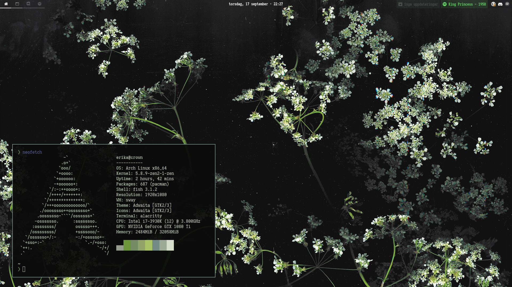

# Dotfiles

## Configuration:

- Distribution: [Arch Linux](https://www.archlinux.org/)
- WM: [Sway](https://github.com/swaywm/sway)
- Bar: [Waybar](https://github.com/Alexays/Waybar/)
- Terminal: [Alacritty](https://github.com/alacritty/alacritty)
- Shell: [Fish](https://fishshell.com/)
- Launcher: [Rofi](https://github.com/davatorium/rofi/)

*Notes*: This is a [Wayland](https://gitlab.freedesktop.org/wayland) setup. All the folder in the `_old` folders were softwares I used before switching.

## Installing

A relatively bare-bone script to automatically install the dotfiles (install packages and do symlinks) exist (`install.sh`) however, it makes the following assumptions:

- You're using Arch Linux (internally use pacman to install packages)
- You want to install all the files, you can't select specific features but you can choose not to do symlinks and do those manually
- Your dotfiles are located at `~/dotfiles` (only required for symlinking)

Also, the install script doesn't install packages and dependencies only available in the AUR, you'll have to install those manually. They are listed below. An AUR helper will not be installed. [(I recommend yay if one is needed)](https://github.com/Jguer/yay)

**Important**: When doing symlinking, the script will FORCE DELETE (`rm -f`) files before doing the links. This might result in data loss if you're not careful. Beware!

## Requirements:
- [Autotiling](https://github.com/nwg-piotr/autotiling) switch the split orientation automatically based on current window dimensions (like bspwm and dwm).
    - [An alternative to this with better performance](https://github.com/chmln/i3-auto-layout) exists however, it [currently breaks tabbed and stacked layouts](https://github.com/chmln/i3-auto-layout/issues/2)
- [Git version of Grimshot](https://aur.archlinux.org/packages/grimshot-git/), for the window screenshot feature (super+shift+p). This won't be needed once the [grimshot package](https://aur.archlinux.org/packages/grimshot) is updated.
- [Nerd-patched Fira Code](https://aur.archlinux.org/packages/nerd-fonts-fira-code/) the normal and mono versions are used all over the setup. For Waybar, for Sway, for Mako etc. Once [support for ligatures is added to Alacritty](https://github.com/alacritty/alacritty/issues/50) it will most likely be used there as well.

A [list](https://wiki.archlinux.org/index.php/Pacman/Tips_and_tricks#Install_packages_from_a_list) of the AUR packages required can be found in the [aur-packages](./aur-packages) file

Before installing, I recommend checking out the `autostart` file located in the `sway` folder and removing the entries you don't need. Only the first line is needed for the setup to work since this setup use [pywal](https://github.com/dylanaraps/pywal) to automatically generate a color scheme based on my wallpaper. All the config files are based on the color scheme generated so if you're using another wallpaper / no wallpaper, your setup might look a little funny